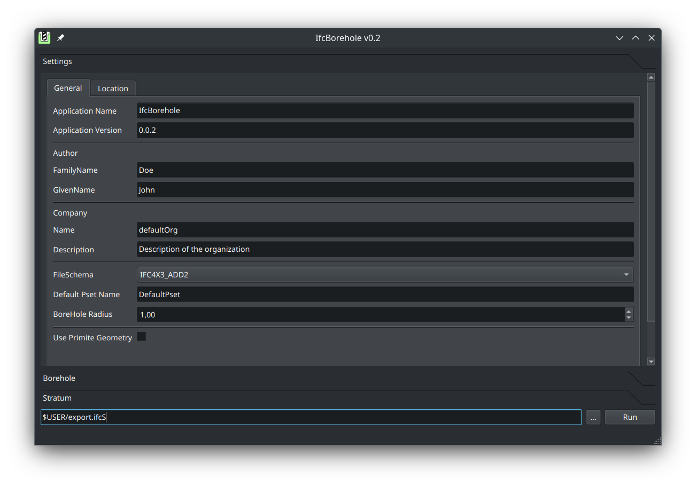

# IfcBorehole

> **IfcBorehole** provides both a **command‑line interface (CLI)** and a **PySide6 GUI** for converting borehole data stored in Excel/CSV/GeoPackage files into fully‑compliant **IFC 4x3 geotechnical models** (\`IfcBorehole\`, \`IfcGeotechnicalStratum\`, …). The library exposes a DataFrame‑centric API so you can also script the workflow directly from Python.

---

## Table of Contents

1. [Features](#features)
2. [Installation](#installation)
3. [Quick Start](#quick-start)
4. [Excel Template](#excel-template)
5. [Python API](#python-api)
6. [Roadmap](#roadmap)
7. [Contributing](#contributing)
8. [License](#license)
9. [Acknowledgements](#acknowledgements)

---

## Features

* **CLI & GUI**: headless batch conversion or interactive desktop app
* **Data source agnostic**: Excel, CSV / TSV, GeoPackage, Shapefile
writer
* **Styled 3‑D entities**: per‑stratum colours and borehole symbolisation
* **Extensible API**: manipulate the underlying *pandas* DataFrames or write your own importers
* **Cross‑platform** (Windows, macOS, Linux) & MIT‑licensed

---

## Installation

### 1 · From PyPI *(coming soon)*

```bash
pip install ifcborehole  # placeholder – package name to be published
```

### 2 · From source (dev‑mode)

```bash
git clone https://github.com/c-mellueh/IfcBorehole.git
cd IfcBorehole
python -m venv .venv
source .venv/bin/activate  # Windows: .venv\Scripts\activate
pip install -r requirements.txt
```

> **Dependencies:** PySide6, pandas, ifcopenshell, numpy, geopandas, fiona, pyqtconsole, appdirs

---

## Quick Start
### Graphical UI

```bash
python -m boreholeGUI
```

The GUI lets you load a data file, preview and edit the borehole/stratum tables, and export to IFC with one click.



---

## Excel Template

`examples/template.xlsx` contains two sheets:

| Sheet        | Purpose            | Required | Key columns                                                |
| ------------ | ------------------ |--|---------------------------------------------------------- |
| **Borehole** |Collar & meta data|Y| `borehole_id`, `name`, `x_pos`, `y_pos`, `z_pos`, `height`           |
||| N|`red`,`green`,`blue`,`transparency`,`ifc_guid`, `ifc_type`   |
| **Stratum**  | Layer information  |Y| `borehole_id`, `name`,`height`,`z_pos` |
||| N|`red`,`green`,`blue`,`transparency`,`ifc_guid`, `ifc_type` , `stratum_shape`, `stratum_id`, `ifc_type`  |

You can, of course, provide the same information in CSV or GeoPackage format – just ensure the column names match.

---

## Python API

```python
from boreholeCreator import tool

# 1. Build DataFrames (or read from Excel)
import pandas as pd
bh = pd.DataFrame([
    {"borehole_id": "BH-101", "name": "Campus-South", "x_pos": 2.2, "y_pos": 3.8, "z_pos": -0.4, "height": 24.,"ifc_type":"IfcBorehole"}
])
strata = pd.DataFrame([
    {"borehole_id": "BH-101", "z_pos": 0., "height": 2., "name": "Clay","red": 1.,"green":0.,"blue":0.,"ifc_type":"IfcGeotechnicalStratum"},
    {"borehole_id": "BH-101", "z_pos": -2., "height": 12., "name": "Sandstone","red": 0.,"green":1.,"blue":0.,"ifc_type":"IfcGeotechnicalStratum"},
])

# 2. Register with the library
tool.Borehole.set_dataframe(bh)
tool.Stratum.set_dataframe(strata)

# 3. Write the IFC file
from boreholeCreator import create_file
create_file("BH-101.ifc")
```

Full API reference → `docs/api.md` *(coming soon)*

---

## Roadmap

* Publish to PyPI (\`ifcborehole\`)
* AGS & LAS importers
* QGIS plugin for visual QC
* Continuous Integration & automated tests

---

## Contributing

1. Fork the repo and create a branch:

   ```bash
   git checkout -b feat/my-awesome-feature
   ```
2. Install dev requirements:

   ```bash
   pip install -r requirements-dev.txt
   ```
3. Run linters & tests before pushing:

   ```bash
   ruff .
   pytest
   ```
4. Open a pull request and describe your changes.

---

## License

This project is released under the [MIT License](LICENSE).

---

## Acknowledgements

* Built on [ifcopenshell](https://github.com/IfcOpenShell/IfcOpenShell)
* Uses [buildingSMART](https://www.buildingsmart.org/) geotechnical domain concepts
* GUI powered by [PySide6](https://doc.qt.io/qtforpython/)
